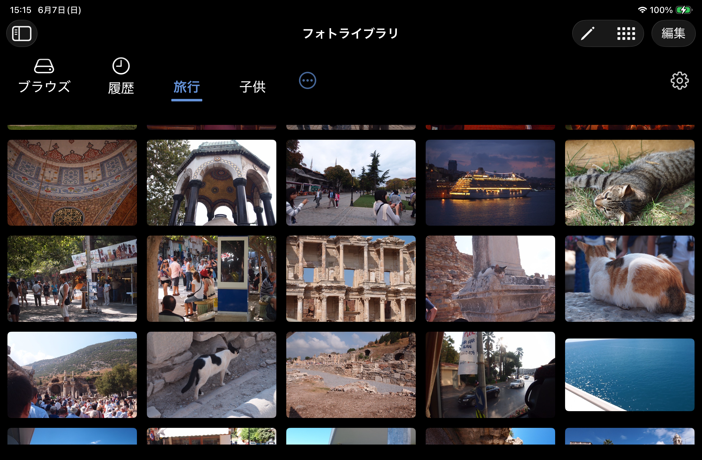

<p align="center">
  
</p>

# PFile

PFile は、iPhone / iPad で NAS、ローカルフォルダ、フォトライブラリ上の動画をリストで整理し、見たい動画へ素早くたどり着くためのファイルブラウザです。

汎用ファイル管理アプリではなく、動画視聴の導線を中心に設計しています。ファイルを探す、リストにまとめる、再生する、履歴やリストから再アクセスする、という一連の流れを扱いやすくすることを目的にしています。

## スクリーンショット

<p align="center">
  
  
  
</p>

## 作った理由

NAS やフォトライブラリにある動画を iPhone / iPad で見るとき、既存のファイルブラウザでは次の点が自分の使い方に合いませんでした。

- 見たい動画を用途別にまとめにくい
- 履歴やリストから再アクセスする導線が弱い
- iPad で動画を探して再生するまでの操作が重い
- NAS、ローカル、フォトライブラリをまたいだ体験が揃っていない

そのため、ファイル管理そのものよりも「動画を見るための導線」を優先したアプリとして作っています。

## 主な機能

- SMB / CIFS 接続
- Files から追加したローカルフォルダの閲覧
- フォトライブラリ連携
- 動画再生
- 画像ビューア
- PDF 閲覧
- 視聴履歴
- リスト管理
- AirPlay ボタン
- 共有ボタンの表示切り替え
- 広告削除買い切り課金の土台

## ディレクトリ構成

```text
PFile/
  App/              アプリ起動、環境注入
  Domain/           モデル、Repository プロトコル
  Features/         画面単位の View / ViewModel
  Infrastructure/   SMB、Keychain、SwiftData 実装
  Services/         履歴、サムネイル、課金、バックアップなど
  Shared/           共通 UI / ルーティング
PFileTests/         Unit Tests
docs/               設計メモ、調査メモ
```

## セットアップ

### 必要なもの

- Xcode
- iOS 17 以降の Simulator または実機
- CocoaPods
- XcodeGen

### 初期化

```sh
make setup
```

`make setup` は `xcodegen generate`、`pod install`、Git hook セットアップを実行します。公開リポジトリを clone した直後は、まずこのコマンドで Xcode プロジェクトを再生成してください。

`PFile/Resources/Info.plist` は `project.yml` から生成する前提のため、リポジトリには含めません。

手動で行う場合は次の順で実行します。

```sh
xcodegen generate
pod install
sh scripts/setup-hooks.sh
```

## ビルドとテスト

ビルド:

```sh
make build
```

テスト:

```sh
make test
```

Xcode から開く場合は、初期化後に `PFile.xcworkspace` を開いてください。

## 設計メモ

- [アーキテクチャ](docs/architecture.md)
- [NAS 動画再生方式の調査](docs/nas-video-playback-research.md)
- [データモデル](docs/data-models.md)
- [メディアリスト設計](docs/media-list-design.md)
- [視聴履歴](docs/watch-history.md)

## ライセンス

MIT
